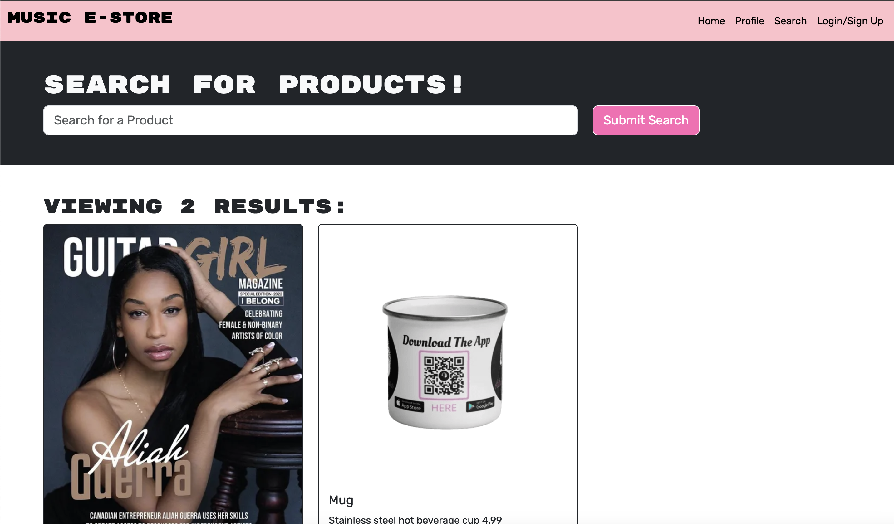

# Music E-Store

## Description

The Music E-Store application is a Full stack e-commerce platform utilizing MongoDB, Express.js, React, and Node.js (MERN). Other technologies used are Vite, Dotenv, Bcrypt, Express-sessions, JSON Web Token (JWT), Render, MongoDB Atlas, and Stripe that offers a seamless online shopping experience. The key features include a responsive layout, user authentication, product browsing, cart management and front-end order processing. Users will interact with the home dashboard, navigation bar, search bar, and login pages to navigate the site. Product previews, dynamic quantity updates in the cart and detailed pricing calculations will enhance the user experience. Secure user authentication ensures the data privacy, with redirection to the login page for unauthorized users. Once logged in, users can manage their orders, view detailed product information and confirm orders on their account securely. An alert system will notify users of successful order processing ensuring a smooth and reliable shopping experience. 

## Table of contents
- [Installation](#installation)
- [Screenshot](#screenshot)
- [Features](#features)
- [Usage](#usage)
- [credits](#credits)
- [License](#license)
- [Contributing](#contributing)
- [Testing](#testing)

## Installation
1. Copy and paste the repo in the terminal
2. Git clone git@github.com:AliahG97/project-3.git
3. Run "npm install" to install the necessary dependencies, including Vite version 5.1.6.
4. Set up your MongoDB database by importing the provided schema and seeds files.
5. Update the database connection details (PORT) in the application code.

## Screenshot

## Features
1. Responsive online store: Utilizing bootstrap and React to segregate the main page and other pages for efficient layout management on all devices and screen dimensions.

2. Navigation bar & footer: Consistently accessible for easy navigation at the top of all pages, and access to the company's social media page at the bottom of all pages, opening a new tab to Facebook and Instagram.

3. Homepage preview: Users are presented with a search bar where they can search for items. Once users search for products, the products searched, if they exist, are displayed.

4. Product viewing: Products are displayed with detailed information, including name description, price and photo. Each product has a  button to add the product to the cart. 

5. Add to cart: Users can add new products to their cart, reflected by the cart badge in the navigation bar. Multiple clicks increase the product quantity which is only visible on the order/cart page.

6. Check out process: After adding all the desired products to the cart, the user can proceed to check out. However, login is required to view their cart items / access current order.

7. Login & Sign up: If not logged in, users are redirected to the login page to either sign up or login with an existing account. If the user forgot their password an email to opens when the forgot password is clicked, and the user can request to reset their password.

8. Profile page: After logging in, users are redirected to the Profile page to view and confirm their order.

9. Cart management: Cart displays added products with quantity, individual prices, and calculated total. Users can click the "remove" button on specific items removing them from the cart (session) permanently.

10. Confirmation: Once the user is satisfied with the items in the cart, quantity and the grand total, the user can confirm the order by clicking the  "confirm order" button at the bottom of the page. The user will be redirected to the top of the cart/order page where they receive an alert notifying them that the order was successfully processed.

## Usage
The Music E-Store is perfect for artists or musicians who may not be technically skilled, but need an e-store template that allows them to have an online store without having to pay for monthly website hosting fees or give up a percentage of their sales to the website hosting company. Also, this application has a secured way of their customers/fans being able to register their email addresses on file, and the artist will be able to own this data and have the ability to leverage it as marketing emailing list which is not possible with instagram, facebook and other social media platforms.

## Credits
Aliah Guerra (https://github.com/AliahG97)
Andrew Biron (https://github.com/gah-mewbittik)
Siva Sivanishanthar (https://github.com/sivanishanthar)
Ryan Walker (https://github.com/Ryanwalker2)

## License
Creative Commons License

© Music E-Store 2024. Confidential and Proprietary. All Rights Reserved.

## Contributing
- Upon the order being successfully processed, generate a 7 digit unique id and call it the order number, followed by a 10 character alphanumeric unique id and call it the tracking number.

- Create a back end for admin to update the order status from pending, to shipped with an eta of "10 days or less" after the time and date that the order was placed.

- Integrate Stripe Payment processor to reflect the items selected and grand total.

- Make it possible for the users to view previous orders.

- Integrate a real reset password procedure.

## Testing
1. Cd to project file
2. npm install
3. npm run seed
4. npm start
5. 
6. 
7. 

